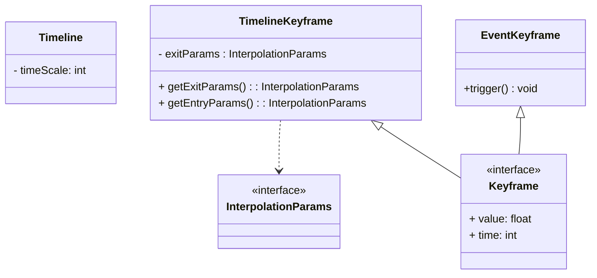

# Keyframes

# Timeline
## timeScale

Check the ticks and see if one would lie on a value

# EventKeyframe
TODO need to explore what happens if something is client side only
and something is spawned in between logical ticks

Or possibly add certain types of events that cause a delay in some way

E.g. if you want to have a load of things spawn in but 20 ticks seems too choppy
It could visually delay the spawning of the mob or possibly have it show client side early
before it actually spawns server side.

Though this should be left as a far later experiment, focus on logical ticks for now.

